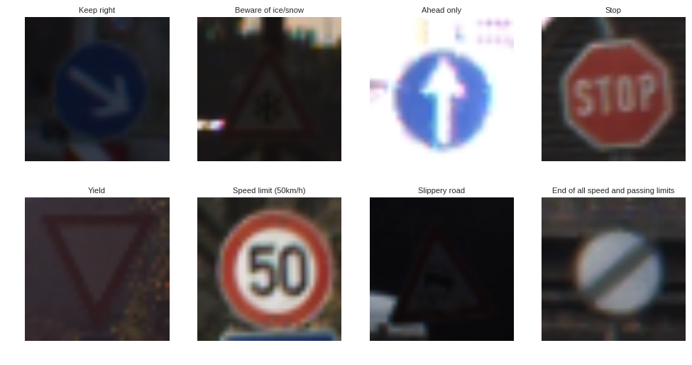

# workshop-traffic-signs

## Getting Started
1. Clone or download this repository
2. Get the data
3. Setup your environment

## Data
For this workshop we will be using the [German Traffic Sign Recognition Benchmark Dataset](http://benchmark.ini.rub.de/?section=gtsrb&subsection=news). 

Particularly a preprocessed version from [Udacity](https://www.udacity.com/) which is also used in one of the projects in their [Self-Driving Car Nanodegree Programm](https://www.udacity.com/course/self-driving-car-engineer-nanodegree--nd013).

In this version all the images are resized to 32x32 pixels and already split into a train and test set. The data can be downloaded [here](https://drive.google.com/open?id=0B02X9kiSe3GBamlKYndVMi1raGM).



## Setup

We will use python with the following packages:

- [jupyter](http://jupyter.org/)
- [TensorFlow](http://tensorflow.org)
- [Keras](https://keras.io/)

The easiest way to get started is by installing [anaconda](https://www.continuum.io/downloads). Anaconda allows to create virtual environments to keep everything nice an clean. After installing anaconda your command line tool of choice and execute the following statements.

### Environment

The next line will create a new environment and install numpy, jupyter, matplotlib, scikit-learn and seaborn. Replace "env-name" with the name you want to call your environment.

```
conda create -n env-name numpy jupyter matplotlib scikit-learn seaborn tqdm
```

After the environment was created you have to activate it before you can install additional packages or actually use it. How you activate an environment depends on you OS. Remember to replace "env-name" with the name you chose.

**Linux**
```
source activate env-name
```

### Tensorflow

Next step is to install tensorflow which can be installed with or without gpu support. Since the gpu version is more complicate to setup and requires additional libraries like Cuda we will go with the cpu version for now. Still if you have a powerful gpu you can follow the official setup [guide](https://www.tensorflow.org/get_started/os_setup) to install the gpu version which will be a lot faster. 

CPU Version
```
pip install tensorflow
```

GPU Version

- switch to X.org Nouveu drivers
- CUDA pre installation [steps](https://docs.nvidia.com/cuda/cuda-installation-guide-linux/index.html#pre-installation-actions)
- install [CUDA deb](https://developer.nvidia.com/cuda-downloads?target_os=Linux&target_arch=x86_64&target_distro=Ubuntu&target_version=2004)
- CUDA post installation [steps](https://docs.nvidia.com/cuda/cuda-installation-guide-linux/index.html#post-installation-actions)
- install [CUDA cuDNN](https://developer.nvidia.com/cudnn)
- install [TensorRT](https://developer.nvidia.com/nvidia-tensorrt-download)
```
pip install tensorflow-gpu
```

if any issues with Tensorflow and Cuda versions (Ubuntu 20.04):
```
conda install tensorflow-gpu cudatoolkit=10.1
```

### Keras

Finally install keras.
```
pip install keras
```
